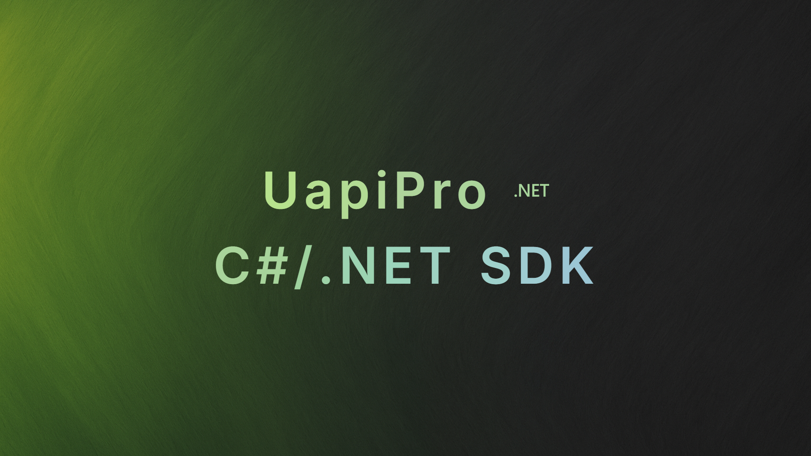

# uapi-sdk-csharp



[](https://dotnet.microsoft.com/)
[](https://uapis.cn/)

> [!NOTE]
> 所有接口的 C# 示例都可以在 [UApi](https://uapis.cn/docs/introduction) 的接口文档页面，向下滚动至 **快速启动** 区块后直接复制。

## 快速开始

```bash
dotnet add package uapi-sdk-csharp
```

```csharp
using System;
using System.Collections.Generic;
using uapi;

var client = new Client("https://uapis.cn/api/v1");
var result = await client.Social.getSocialQqUserinfoAsync(new Dictionary<string, object?> { ["qq"] = "10001" });
Console.WriteLine(result);
```

## 特性

现在你不再需要反反复复的查阅文档了。

只需在 IDE 中键入 `client.`，所有核心模块——如 `Social`、`Game`、`Image`——即刻同步展现。进一步输入即可直接定位到 `getSocialQqUserinfoAsync` 这样的具体方法，其名称与文档的 `operationId` 严格保持一致，确保了开发过程的直观与高效。

所有方法签名只接受真实且必需的参数。当你在构建请求时，IDE 会即时提示 `qq`、`username` 等键名，这彻底杜绝了在 `Dictionary<string, object?>` 中因键名拼写错误而导致的运行时错误。

针对 401、404、429 等标准 HTTP 响应，SDK 已将其统一映射为具名的异常类型。这些异常均附带 `Code`、`Status`、`Details` 等关键上下文信息，确保你在日志中能第一时间准确、快速地诊断问题。

`Client` 基于 `HttpClient`，构造函数会设置 BaseAddress 并自动追加 `Authorization` 头；如果你想引入代理、超时或重试策略，只需包装一个自定义的 `HttpClient` 传入即可。

如果你需要查看字段细节或内部逻辑，仓库中的 `./internal` 目录同步保留了由 `openapi-generator` 生成的完整结构体，随时可供参考。

## 错误模型概览

| HTTP 状态码 | SDK 错误类型                                  | 附加信息                                                                          |
|-------------|----------------------------------------------|------------------------------------------------------------------------------------|
| 401/403     | `UnauthorizedError`                          | `code`、`status`                                                                   |
| 404         | `NotFoundError` / `NoMatchError`             | `code`、`status`                                                                   |
| 400         | `InvalidParameterError` / `InvalidParamsError` | `code`、`status`、`details`                                                        |
| 429         | `ServiceBusyError`                           | `code`、`status`、`retry_after_seconds`                                            |
| 5xx         | `InternalServerErrorError` / `ApiErrorError` | `code`、`status`、`details`                                                        |
| 其他 4xx    | `UapiError`                                  | `code`、`status`、`details`                                                        |

## 其他 SDK

| 语言        | 仓库地址                                                     |
|-------------|--------------------------------------------------------------|
| Go          | https://github.com/AxT-Team/uapi-go-sdk                      |
| Python      | https://github.com/AxT-Team/uapi-python-sdk                  |
| TypeScript| https://github.com/AxT-Team/uapi-typescript-sdk           |
| Browser (TypeScript/JavaScript)| https://github.com/AxT-Team/uapi-browser-sdk        |
| Java        | https://github.com/AxT-Team/uapi-java-sdk                    |
| PHP         | https://github.com/AxT-Team/uapi-php-sdk                     |
| C#（当前）          | https://github.com/AxT-Team/uapi-csharp-sdk                  |
| C++         | https://github.com/AxT-Team/uapi-cpp-sdk                     |
| Rust        | https://github.com/AxT-Team/uapi-rust-sdk                    |

## 文档

访问 [UApi文档首页](https://uapis.cn/docs/introduction) 并选择任意接口，向下滚动到 **快速启动** 区块即可看到最新的 C# 示例代码。
